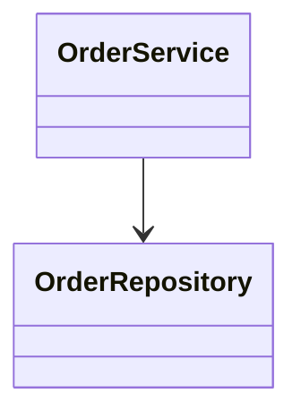
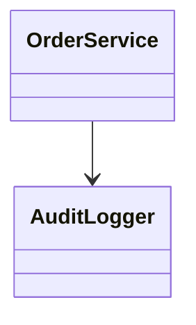
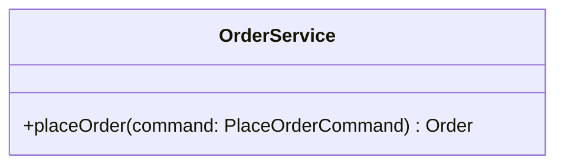
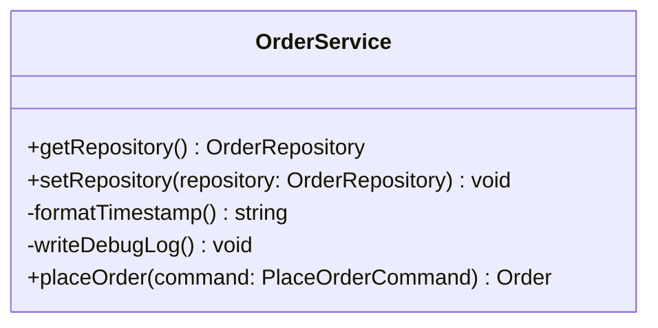
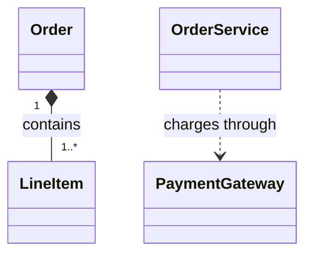
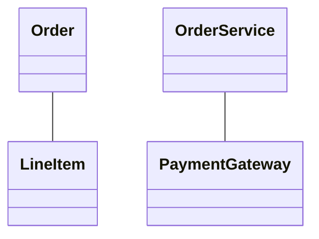

# Rule 1 - 類別圖必須使用固定的 Mermaid 結構

- 類別圖必須放在語言標記為 `mermaid` 的 code block。
- Mermaid code block 的第一個非空白內容必須是 `classDiagram`。
- 設計說明與實作順序必須放在 Mermaid code block 之外。
- 類別圖必須在向使用者展示前通過 Mermaid 語法檢查。

## Good Example

- Code block 使用 `mermaid` 語言標記，以 `classDiagram` 開始，且只包含 Mermaid 語法。

````markdown


`OrderService` 負責協調訂單流程。
````

## Bad Example

- Code block 未使用 `mermaid` 語言標記，且將設計說明混入圖中。

````markdown
```
OrderService --> OrderRepository
OrderService 負責協調訂單流程。
```
````

# Rule 2 - 圖中的類別必須完整且名稱一致

- 所有預計新增或修改的類別必須出現在類別圖中。
- 影響本次類別關係的既有類別必須出現在類別圖中。
- 既有類別的名稱必須與程式碼中的 identifier 一致。
- 新類別的名稱必須在類別圖、設計說明與實作順序中保持一致。
- 與本次提案無關的類別不得加入類別圖。

## Good Example

- 提案修改 `OrderService` 並新增 `OrderRepository`，兩個類別均出現在圖中且名稱一致。


設計說明：`OrderService` 透過新增的 `OrderRepository` 存取訂單。

## Bad Example

- 圖中遺漏新增的 `OrderRepository`，並加入與本次提案無關的 `AuditLogger`。



設計說明：`OrderService` 透過新增的 `OrderRepository` 存取訂單。

# Rule 3 - 類別成員必須維持設計層級

- 類別圖應只列出用來表達類別責任、公開契約或重要狀態的成員。
- 不影響類別責任、協作關係或公開契約的 private helper、getter、setter 與實作細節不得列入類別圖。
- 成員的 visibility、參數或回傳型別影響類別協作時必須標示。
- 類別責任不需要成員即可表達時，可以只列出類別名稱。

## Good Example

- 圖中只列出協作者需要使用的公開契約，省略內部格式化與記錄方法。



## Bad Example

- 圖中列出不影響設計判斷的 getter、setter 與 private helper，掩蓋主要契約。



# Rule 4 - 關係必須使用對應的 Mermaid 符號

- 已確定的類別關係必須使用下表對應的 Mermaid 符號。

| 類別關係       | Mermaid 符號 |
| -------------- | ------------ |
| 繼承           | `<|--`       |
| Interface 實作 | `<|..`       |
| Composition    | `*--`        |
| Aggregation    | `o--`        |
| Association    | `-->` 或 `--` |
| Dependency     | `..>`        |

- 不同關係不得僅為簡化輸出而全部改寫成 Association。
- Multiplicity、方向或關係標籤影響設計理解時必須標示。

## Good Example

- 圖中使用 Composition 表示訂單擁有項目，並使用 Dependency 表示服務暫時依賴付款介面。



## Bad Example

- 圖中將所有關係寫成無方向的 Association，遺失所有權與依賴語意。



# Rule 5 - 類別圖與配套文字必須互相對應

- 圖中的每個新增或修改類別必須在設計說明中具有簡短的責任說明。
- 設計說明與實作順序必須使用類別圖中的類別名稱。
- 實作順序必須與類別圖所呈現的相依性一致。
- 類別圖、設計說明與實作順序不得描述互相矛盾的責任或關係。

## Good Example

- 設計說明與實作順序使用圖中的名稱，且先實作被依賴的 `OrderRepository`。


- `OrderRepository`：提供訂單持久化契約。
- `OrderService`：協調訂單流程並依賴 `OrderRepository`。
- 實作順序：`OrderRepository`、`OrderService`。

## Bad Example

- 配套文字改用圖中不存在的名稱，且實作順序沒有對應圖中的相依性。


- `OrderStore`：負責協調訂單流程。
- 實作順序：`OrderService`、`OrderStore`。
