# Rule 1 - 類別圖必須使用固定的 Mermaid 結構

- 類別圖必須放在語言標記為 `mermaid` 的 code block。
- 除了樣板固定的 `%%{init}%%` 指令外，Mermaid code block 的第一個非空白內容必須是 `classDiagram`。
- 設計說明與實作順序必須放在 Mermaid code block 之外。
- 類別圖不得使用 `classDef` 或 `style` 陳述式；Mermaid 10.2.3 的類別圖不支援這兩種語法，類別顏色只能由樣板固定的 `%%{init}%%` 指令提供。
- 類別圖必須在向使用者展示前通過 Mermaid 語法檢查。

## Good Example

### Example 1

- Code block 使用 `mermaid` 語言標記，以 `classDiagram` 開始，且只包含 Mermaid 語法。

````markdown
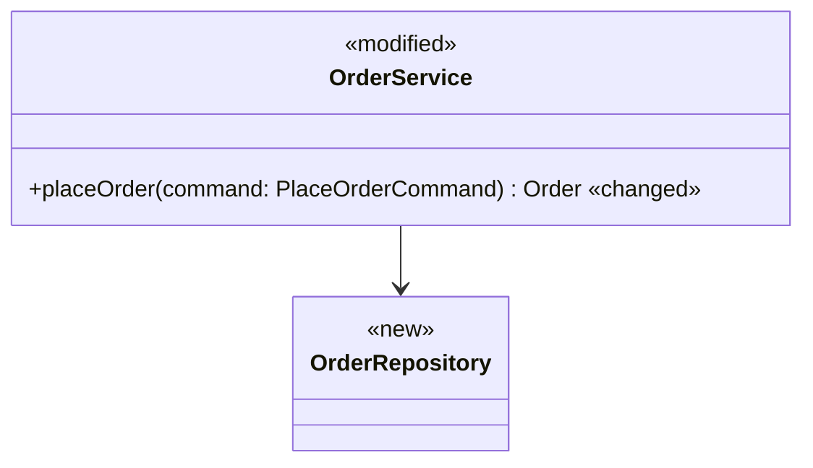

`OrderService` 負責協調訂單流程。
````

### Example 2

- 類別只以 `:::` 套用樣式類別，顏色交給樣板固定的 `%%{init}%%` 指令，Mermaid 10.2.3 可以解析。

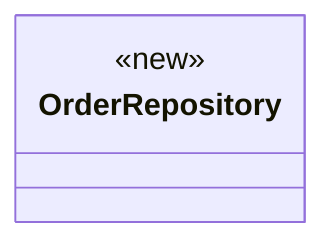

## Bad Example

### Example 1

- Code block 未使用 `mermaid` 語言標記，且將設計說明混入圖中。

````markdown
```
OrderService --> OrderRepository
OrderService 負責協調訂單流程。
```
````

### Example 2

- 圖中自行加入 `classDef`，Mermaid 10.2.3 在該行回報語法錯誤，整張圖無法顯示。

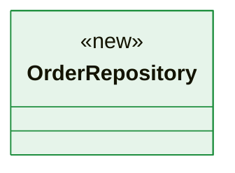

# Rule 2 - 圖中的類別必須完整且名稱一致

- 所有預計新增、修改或刪除的類別必須出現在類別圖中。
- 影響本次類別關係的既有類別必須出現在類別圖中。
- 既有類別的名稱必須與程式碼中的 identifier 一致。
- 新類別的名稱必須在類別圖、設計說明與實作順序中保持一致。
- 與本次提案無關的類別不得加入類別圖。

## Good Example

- 提案修改 `OrderService`、新增 `OrderRepository` 並刪除 `LegacyOrderDao`，三個類別均出現在圖中且名稱一致。

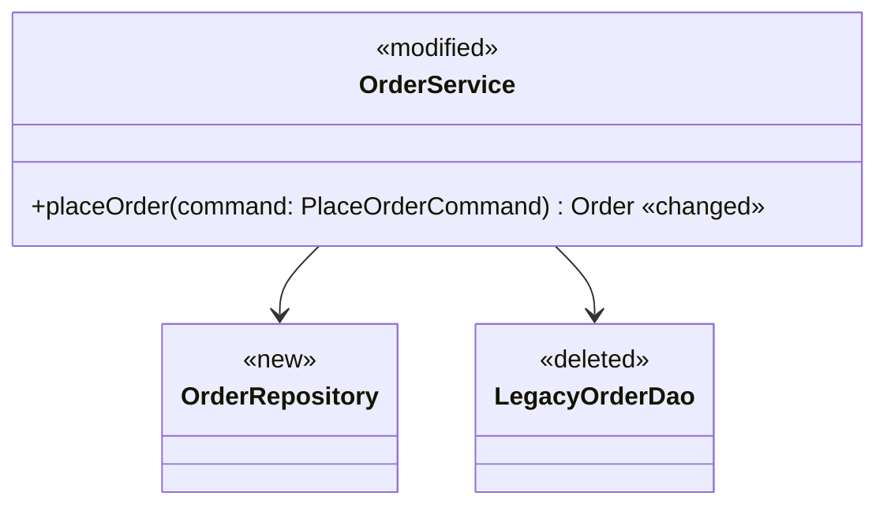

設計說明：`OrderService` 改為透過新增的 `OrderRepository` 存取訂單，並刪除 `LegacyOrderDao`。

## Bad Example

- 圖中遺漏新增的 `OrderRepository` 與要刪除的 `LegacyOrderDao`，並加入與本次提案無關的 `AuditLogger`。

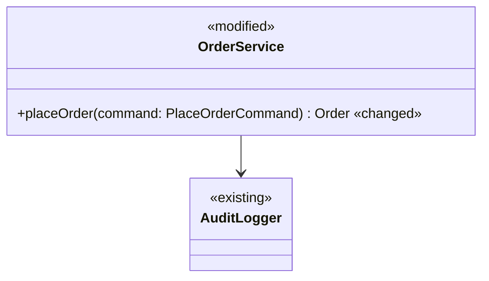

設計說明：`OrderService` 改為透過新增的 `OrderRepository` 存取訂單，並刪除 `LegacyOrderDao`。

# Rule 3 - 類別成員必須維持設計層級

- 類別圖應只列出用來表達類別責任、公開契約或重要狀態的成員。
- 不影響類別責任、協作關係或公開契約的 private helper、getter、setter 與實作細節不得列入類別圖。
- 成員的 visibility、參數或回傳型別影響類別協作時必須標示。
- 類別責任不需要成員即可表達時，可以只列出類別名稱。

## Good Example

- 圖中只列出協作者需要使用的公開契約，省略內部格式化與記錄方法。

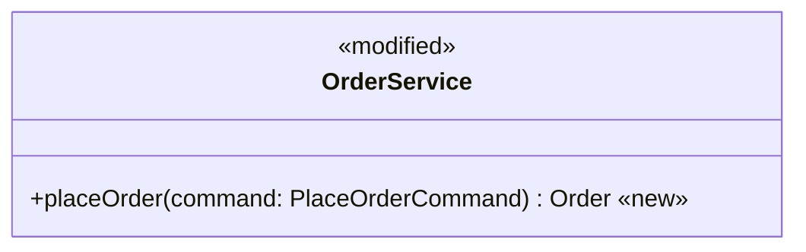

## Bad Example

- 圖中列出不影響設計判斷的 getter、setter 與 private helper，掩蓋主要契約。

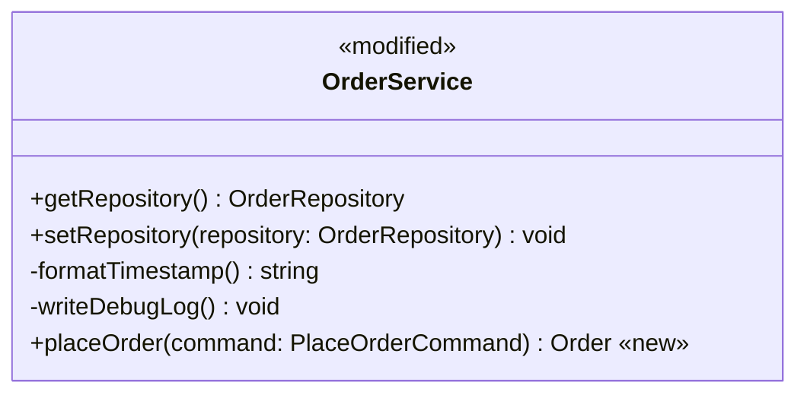

# Rule 4 - 關係必須使用對應的 Mermaid 符號

- 已確定的類別關係必須使用下表對應的 Mermaid 符號。

| 類別關係       | Mermaid 符號 |
| -------------- | ------------ |
| 繼承           | `<|--`       |
| Interface 實作 | `<|..`       |
| Composition    | `*--`        |
| Aggregation    | `o--`        |
| Association    | `-->` 或 `--` |
| Dependency     | `..>`        |

- 不同關係不得僅為簡化輸出而全部改寫成 Association。
- Multiplicity、方向或關係標籤影響設計理解時必須標示。

## Good Example

- 圖中使用 Composition 表示訂單擁有項目，並使用 Dependency 表示服務暫時依賴付款介面。

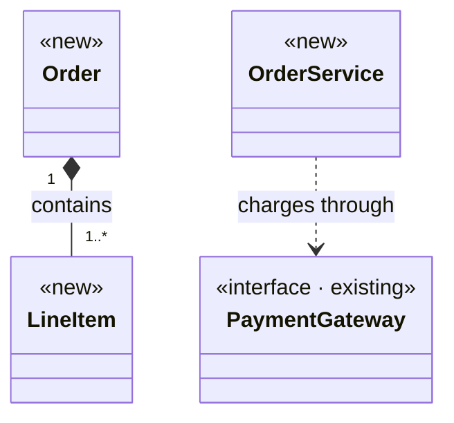

## Bad Example

- 圖中將所有關係寫成無方向的 Association，遺失所有權與依賴語意。

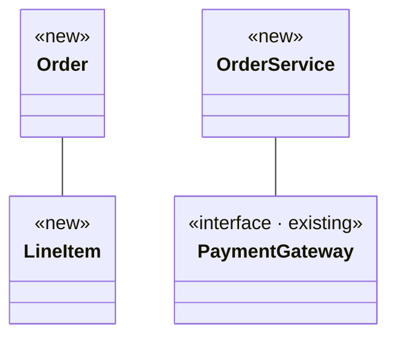

# Rule 5 - 類別圖與配套文字必須互相對應

- 圖中每個新增、修改或刪除的類別必須在設計說明中具有簡短的責任說明，註明變更類型，且與圖中的類別標記一致。
- 設計說明與實作順序必須使用類別圖中的類別名稱。
- 實作順序必須與類別圖所呈現的相依性一致。
- 類別圖、設計說明與實作順序不得描述互相矛盾的責任或關係。

## Good Example

- 設計說明使用圖中的名稱並註明與標記一致的變更類型，實作順序先實作被依賴的 `OrderRepository`。

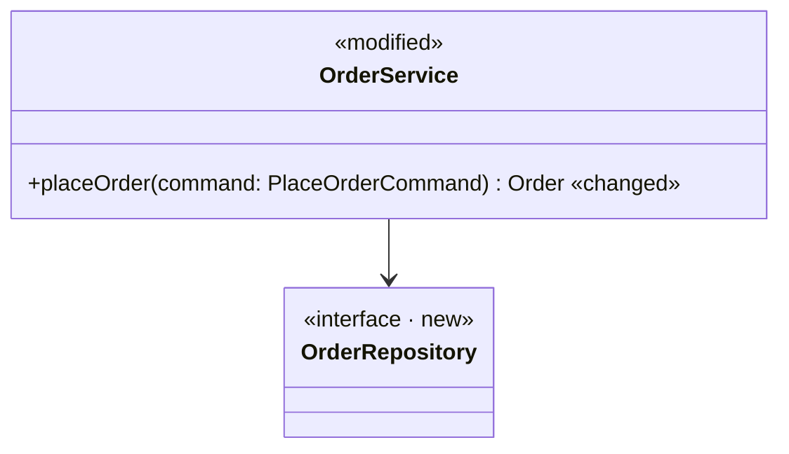

- `OrderRepository`（新增）：提供訂單持久化契約。
- `OrderService`（修改）：`placeOrder` 改為透過 `OrderRepository` 保存訂單。
- 實作順序：`OrderRepository`、`OrderService`。

## Bad Example

- 配套文字改用圖中不存在的名稱，把圖中標示 `<<modified>>` 的 `OrderService` 寫成新增，且實作順序沒有對應圖中的相依性。


- `OrderStore`（新增）：提供訂單持久化契約。
- `OrderService`（新增）：協調訂單流程。
- 實作順序：`OrderService`、`OrderStore`。

# Rule 6 - 類別圖必須標示本次的變更類型

- 每個類別必須在類別本體第一行，以圖例中的類別標記 `<<new>>`、`<<modified>>`、`<<deleted>>` 或 `<<existing>>` 其中一種標示，並以 `:::` 套用圖例中對應的樣式類別。
- 類別標記必須依「相關程式碼現況」判定：目前原始碼中已存在的類別不得標示 `<<new>>`，本次不修改的既有類別必須標示 `<<existing>>`。
- 類別已有 `<<interface>>` 等 annotation 時，必須合併成單一 annotation，例如 `<<interface · new>>`；Mermaid 只會顯示每個類別的第一個 annotation。
- 標示 `<<modified>>` 的類別必須列出本次新增、修改或移除的設計層級成員，並在成員行結尾加上 `«new»`、`«changed»` 或 `«removed»`；沒有標記的成員表示維持原樣，且每個 `<<modified>>` 類別至少有一個帶標記的成員。
- 兩端都是 `<<modified>>` 或 `<<existing>>` 類別的關係，若是本次新增或移除，必須在關係標籤結尾加上 `«new»` 或 `«removed»`，並保留該關係原本的 Mermaid 符號。
- 連到 `<<new>>` 或 `<<deleted>>` 類別的關係，變更已由類別標記表達，不得加上關係標記。

## Good Example

- 移除快取層時，每個類別各有一個標記；介面標記合併成單一 annotation；修改類別標出改變的建構子；連到刪除類別的關係保留原本符號且不加標記，只有兩個非新增、非刪除類別之間新增的關係標示 `«new»`。

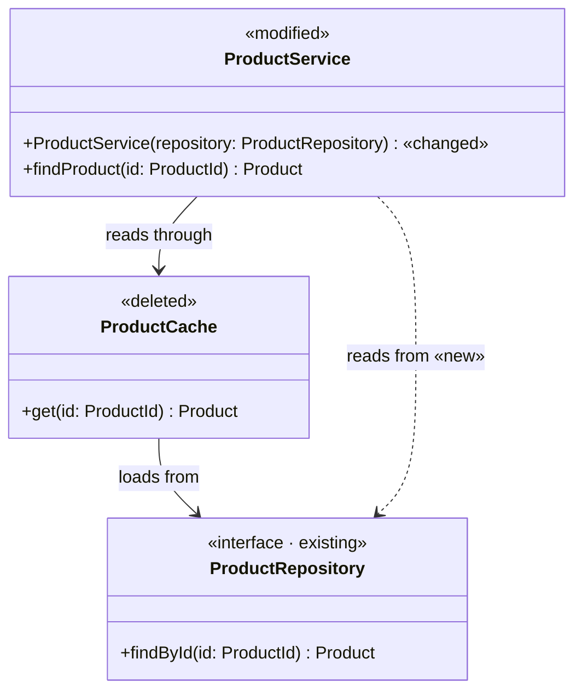

## Bad Example

- 同一情境中，`ProductRepository` 寫成兩行 annotation，第二行的 `<<existing>>` 不會顯示；`ProductService` 沒有任何成員標記，看不出改了什麼；`ProductService` 與 `ProductCache` 的關係從原本的 `-->` 改成 `..>` 來表示移除，改變了關係語意。

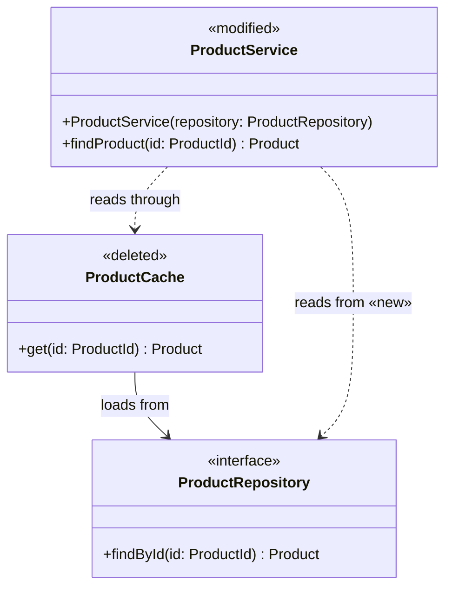
