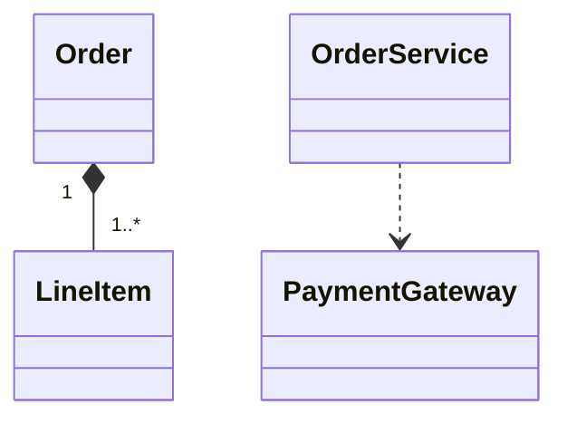
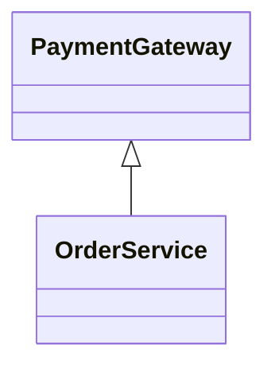

# Rule 1 - 類別與責任必須可追溯至需求

- 每個新增或修改的類別必須對應使用者需求或現有程式碼的具體限制。
- 每項類別責任必須說明其支援的使用情境或系統能力。
- 僅為未確認的未來需求預留的類別與責任不得加入設計。

## Good Example

- 類別與責任分別對應「建立訂單」與「保存訂單」兩項已知需求。

情境：

- 需求：建立訂單後必須保存訂單資料。
- `OrderService`：協調建立訂單的使用情境。
- `OrderRepository`：提供保存訂單的契約。

## Bad Example

- `EventBusFactory` 只服務未確認的未來擴充，無法追溯至目前需求或限制。

情境：

- 需求：建立訂單後必須保存訂單資料。
- `OrderService`：協調建立訂單的使用情境。
- `OrderRepository`：提供保存訂單的契約。
- `EventBusFactory`：預留未來可能需要的事件系統。

# Rule 2 - 類別責任必須具有明確邊界

- 每項責任必須具有唯一且可辨識的主要擁有者。
- 同一類別中的責任必須共同服務一個可描述的目的。
- 不同類別不得在沒有協作界線說明時同時擁有同一項權威責任。
- Interface 或 abstract class 必須對應目前存在的替換、隔離或共用契約需求。

## Good Example

- 訂單協調與資料保存分屬不同類別，且兩者的協作界線明確。

情境：

- `OrderService`：協調建立與取消訂單。
- `OrderRepository`：保存與載入訂單。
- `OrderService` 透過 `OrderRepository` 契約存取訂單資料。

## Bad Example

- `OrderService` 同時負責流程協調、資料庫存取、寄送郵件與發票排版，無法用單一目的描述其責任邊界。

情境：

- `OrderService`：建立訂單、執行 SQL、寄送郵件及排版發票。
- `OrderRepository`：保存訂單，但 `OrderService` 也可以直接修改訂單資料表。

# Rule 3 - 類別關係必須符合實際語意

- 繼承必須表示子類別可替換父類別的 is-a 關係。
- Interface 實作必須表示類別履行該 Interface 定義的契約。
- Composition 必須表示整體擁有部分的生命週期。
- Aggregation 必須表示部分可以獨立於整體存在。
- Association 必須表示穩定的結構性關聯。
- Dependency 必須表示操作期間的暫時使用。

## Good Example

- `Order` 擁有 `LineItem` 的生命週期，`OrderService` 則只在操作期間使用 `PaymentGateway`。

## Bad Example

- 圖中以繼承表示服務對付款介面的暫時使用，關係語意與實際協作不符。

# Rule 4 - 相依性必須導出可執行的開發順序

- 實作順序必須將被依賴的契約、資料型別或基礎類別排在依賴者之前。
- 實作順序必須涵蓋所有預計新增、修改或刪除的類別。
- 刪除類別或成員的步驟必須排在所有依賴者改寫完成之後。
- 類別相依形成循環時，不得將循環直接寫成線性順序。
- 發現循環相依時，必須先調整設計或明確標示需要解決的設計阻礙。

## Good Example

### Example 1

- 實作順序先建立契約與實作者，再改寫依賴契約的服務，最後才刪除已沒有依賴者的舊類別，且涵蓋所有預計新增、修改與刪除的類別。

情境：

- `SqlOrderRepository` 實作 `OrderRepository`。
- `OrderService` 原本依賴 `LegacyOrderDao`，本次改為依賴 `OrderRepository`，並刪除 `LegacyOrderDao`。
- 實作順序：`OrderRepository`、`SqlOrderRepository`、`OrderService`、刪除 `LegacyOrderDao`。

### Example 2

- 發現 `OrderService` 與 `OrderRepository` 互相依賴後，先調整設計解除循環，再排出線性順序。

情境：

- `OrderService` 依賴 `OrderRepository`。
- `OrderRepository` 為了產生訂單編號而依賴 `OrderService`。
- 調整設計：改由 `OrderService` 產生訂單編號後傳給 `OrderRepository`，`OrderRepository` 不再依賴 `OrderService`。
- 實作順序：`OrderRepository`、`OrderService`。

## Bad Example

### Example 1

- 同一情境中，`LegacyOrderDao` 在依賴它的 `OrderService` 改寫前就被刪除，`OrderService` 也排在它依賴的 `OrderRepository` 之前。

情境：

- `SqlOrderRepository` 實作 `OrderRepository`。
- `OrderService` 原本依賴 `LegacyOrderDao`，本次改為依賴 `OrderRepository`，並刪除 `LegacyOrderDao`。
- 實作順序：刪除 `LegacyOrderDao`、`OrderService`、`SqlOrderRepository`、`OrderRepository`。

### Example 2

- 同一情境中，`OrderService` 與 `OrderRepository` 互相依賴，卻直接排列成線性順序，沒有處理循環。

情境：

- `OrderService` 依賴 `OrderRepository`。
- `OrderRepository` 為了產生訂單編號而依賴 `OrderService`。
- 實作順序：`OrderService`、`OrderRepository`。
