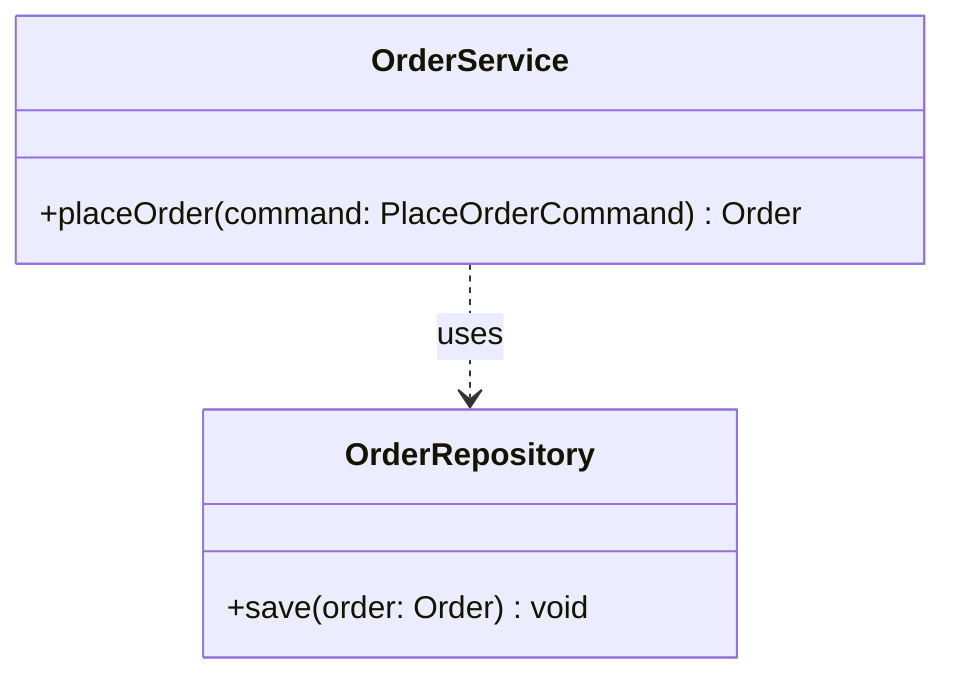

# 類別圖

# 設計說明與實作順序

## 設計說明

- `OrderRepository`：提供保存訂單的契約，封裝訂單資料的持久化責任。
- `OrderService`：協調下單流程，透過 `OrderRepository` 保存訂單。

## 實作順序

1. 建立 `OrderRepository` 契約與 `save(order: Order) void` 操作。
2. 建立 `OrderService`，實作 `placeOrder(command: PlaceOrderCommand) Order`，並依賴 `OrderRepository`。
