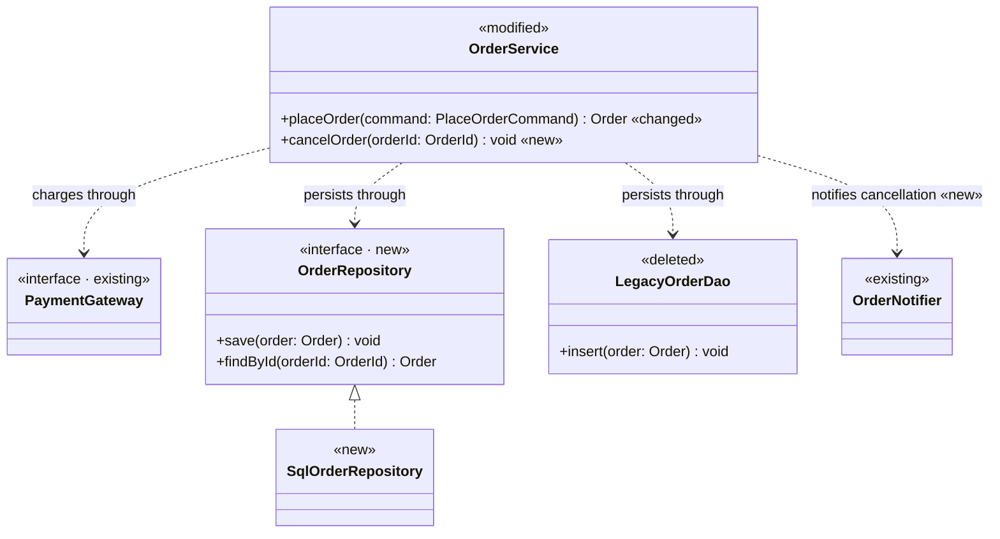

# 類別圖

圖例：

| 標記 | 標在 | 意義 | 樣式類別 |
| ---- | ---- | ---- | -------- |
| `<<new>>` | 類別 | 本次新增的類別 | `added`（綠） |
| `<<modified>>` | 類別 | 既有類別，本次修改其成員或行為 | `changed`（橘） |
| `<<deleted>>` | 類別 | 既有類別，本次刪除 | `removed`（紅色虛線框） |
| `<<existing>>` | 類別 | 既有類別，本次不修改，只呈現協作關係 | `kept`（灰） |
| `«new»` | 成員、關係標籤結尾 | 本次新增的成員或關係 | — |
| `«changed»` | 成員結尾 | 本次修改簽章或行為的成員 | — |
| `«removed»` | 成員、關係標籤結尾 | 本次移除的成員或關係 | — |

# 設計說明與實作順序

## 設計說明

- `OrderRepository`（新增）：提供保存與查詢訂單的契約，取代直接操作資料表的 `LegacyOrderDao`。
- `SqlOrderRepository`（新增）：以 SQL 實作 `OrderRepository`。
- `OrderService`（修改）：`placeOrder` 改為透過 `OrderRepository` 保存訂單；新增 `cancelOrder`，取消後透過 `OrderNotifier` 通知。
- `LegacyOrderDao`（刪除）：資料存取改由 `OrderRepository` 負責，`OrderService` 改寫後已沒有依賴者。
- `PaymentGateway`（既有）：付款契約，本次不修改。
- `OrderNotifier`（既有）：通知元件，本次不修改，由 `cancelOrder` 新增使用。

## 實作順序

1. 建立 `OrderRepository` 契約，再建立實作 `SqlOrderRepository`。
2. 修改 `OrderService`：`placeOrder` 改為依賴 `OrderRepository`，並新增 `cancelOrder` 與對 `OrderNotifier` 的呼叫。
3. 刪除已沒有依賴者的 `LegacyOrderDao`。
