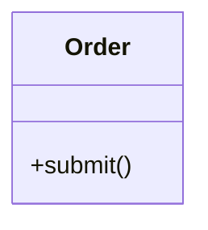

# Rule 1 - 每份樣板必須是一組同格式檔案

- 每份樣板必須包含骨架 `templates/<樣板名字>.<格式>` 與範例 `templates/<樣板名字>.example.<格式>`。
- 兩個檔案必須位於同一個目標 Skill 的 `templates/` 目錄，並使用相同的樣板名字與副檔名。
- 建立或修改樣板時，必須同時檢查這兩個檔案。

## Good Example

- 兩個路徑具有相同的樣板名字與 `.mmd` 副檔名。

```text
templates/class-diagram.mmd
templates/class-diagram.example.mmd
```

## Bad Example

- 範例缺少 `.example` 命名，且副檔名與骨架不同。

```text
templates/class-diagram.mmd
templates/class-diagram-sample.md
```

# Rule 2 - 骨架內容必須可直接作為產出檔案的起點

- 骨架的整個檔案內容必須是目標格式的樣板，保留產出檔案需要的固定結構與字面內容。
- 骨架中的填位符號必須放在執行步驟需要改寫的內容或參數位置。
- 使用方式的說明必須留在 Skill 的 SOP 或 RuleFile；骨架不得加入不屬於目標產出檔案的說明文字或 Markdown 圍欄。

## Good Example

- 骨架本身就是 Mermaid 檔案內容，填入名稱後即可作為類別圖。

```mermaid
classDiagram
    class {{CLASS_NAME}} {
        +{{METHOD_NAME}}()
    }
```

## Bad Example

- 檔案開頭的說明與 Markdown 圍欄都不是 `.mmd` 產出內容。

````text
請把下列程式碼複製到 Mermaid 檔案：
```mermaid
classDiagram
    class {{CLASS_NAME}}
```
````

# Rule 3 - 填位符號必須能一致地替換

- 必須依目標格式選擇可辨識、且不會與固定內容混淆的填位符號寫法；不強制所有格式共用同一種寫法。
- 同一填位符號在骨架中重複出現時，必須代表相同的待填值。
- 每個填位符號必須對應可從指定步驟的輸入決定的內容或參數；若需要整段可變結構，必須用一個可明確替換的區塊填位符號表示。

## Good Example

- `{{CLASS_NAME}}` 兩次都指向同一個類別名稱，`{{METHOD_NAME}}` 指向方法名稱。

```mermaid
classDiagram
    class {{CLASS_NAME}} {
        +{{METHOD_NAME}}()
    }
    note for {{CLASS_NAME}} "Domain entity"
```

## Bad Example

- 同一個 `{{NAME}}` 同時代表類別與方法，替換時無法維持一致語義。

```mermaid
classDiagram
    class {{NAME}} {
        +{{NAME}}()
    }
```

# Rule 4 - 範例必須展示骨架的完整實例

- 範例必須以與骨架相同的目標格式，呈現一份可閱讀的完整產出檔案。
- 範例必須保留骨架的固定結構，並以具體內容取代每個填位符號。
- 範例不得留下骨架使用的填位符號，也不得改成另一種檔案結構。

## Good Example

- 範例保留類別圖結構，並把類別與方法的填位符號換成具體值。



## Bad Example

- 範例仍含填位符號，無法示範填完後的檔案。

```mermaid
classDiagram
    class Order {
        +{{METHOD_NAME}}()
    }
```

# Rule 5 - 驗證必須涵蓋整組樣板

- 必須檢查兩個檔案的路徑、固定結構與填位符號對應，並確認範例沒有未替換的填位符號。
- 目標格式有可用的解析或渲染工具時，必須驗證範例；骨架若因填位符號而無法解析，必須先以範例值替換後再驗證。
- 修改骨架或範例任一檔案後，必須重新檢查另一個檔案是否仍與其對應。

## Good Example

- 修改骨架新增 `{{METHOD_NAME}}` 後，範例補上具體方法名稱，再檢查兩份 `.mmd` 的結構與範例解析結果。

情境：

1. 骨架新增 `+{{METHOD_NAME}}()`。
2. 範例新增 `+submit()`。
3. 檢查範例可被 Mermaid 解析。

## Bad Example

- 只改骨架，沒有重新檢查範例，因此範例已不能展示新骨架的完整產出。

情境：

1. 骨架新增 `+{{METHOD_NAME}}()`。
2. 範例仍只有空的類別宣告。
3. 未檢查骨架與範例的對應。
