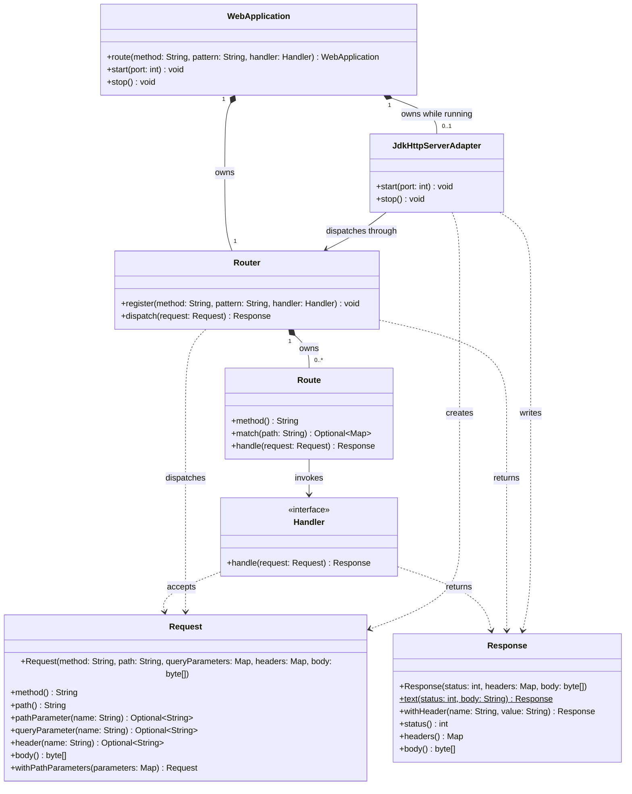

# 類別圖

# 設計說明與實作順序

## 設計說明

本計畫以 Java 17+ 與 JDK `jdk.httpserver` 模組實作最小可用的同步 HTTP 框架：註冊 HTTP 方法與路徑、讀取請求、執行處理函式、送出狀態碼／標頭／本文，以及啟停伺服器。路徑支援固定片段與 `{name}` 參數，例如 `/users/{id}`。

- `Request`：不可變的請求資料。提供方法、路徑、查詢參數、標頭、本文與路徑參數；查詢參數與標頭重複時，單值查詢方法回傳第一個值，缺值回傳 `Optional.empty()`。`withPathParameters` 讓路由器建立帶有比對結果的新請求。
- `Response`：不可變的回應資料。持有狀態碼、標頭與位元組本文；`text` 產生 UTF-8 文字回應，`withHeader` 回傳加入標頭的新回應。建構與讀取位元組本文時採防禦性複製。
- `Handler`：應用程式提供的函式式介面；接收 `Request` 並回傳 `Response`，供 lambda 註冊路由。
- `Route`：保存單一路由的 HTTP 方法、路徑樣板與 `Handler`；`match` 回傳 `Optional<Map<String, String>>`，其中 Map 是擷取到的路徑參數。它只負責自身的路徑比對與呼叫處理函式。
- `Router`：擁有已註冊的 `Route`，依方法與路徑選擇路由，將路徑參數放入 `Request` 後呼叫對應的 `Handler`。沒有路徑符合時回傳 404；路徑符合但方法不符時回傳 405 並設定 `Allow` 標頭。重複的「方法＋樣板」註冊會被拒絕；重疊路由優先選擇固定片段較多者，同分時依註冊順序。
- `JdkHttpServerAdapter`：持有 JDK `HttpServer`，將 `HttpExchange` 轉為 `Request`，交給 `Router`，再寫出 `Response` 並關閉 exchange；處理函式未捕捉的例外由此轉為 500 回應。
- `WebApplication`：框架的入口，擁有 `Router`，在啟動期間擁有 `JdkHttpServerAdapter`；對應用程式提供 `route`、`start` 與 `stop`。伺服器啟動後禁止新增路由，避免請求處理期間變更路由表。

## 實作順序

1. 建立獨立的資料契約 `Request` 與 `Response`，接著建立依賴兩者的 `Handler`。
2. 建立 `Route`，完成路徑樣板解析、路徑參數擷取與 `Handler` 呼叫。
3. 建立 `Router`，完成註冊、優先順序、404／405 回應及路徑參數傳遞。
4. 建立 `JdkHttpServerAdapter`，完成 HTTP 交換轉換、500 回應及伺服器啟停。
5. 建立 `WebApplication`，串接路由註冊與伺服器生命週期。
6. 以實際 HTTP 請求驗證固定路徑、參數路徑、404、405、500 與停止伺服器後釋放連接埠。
