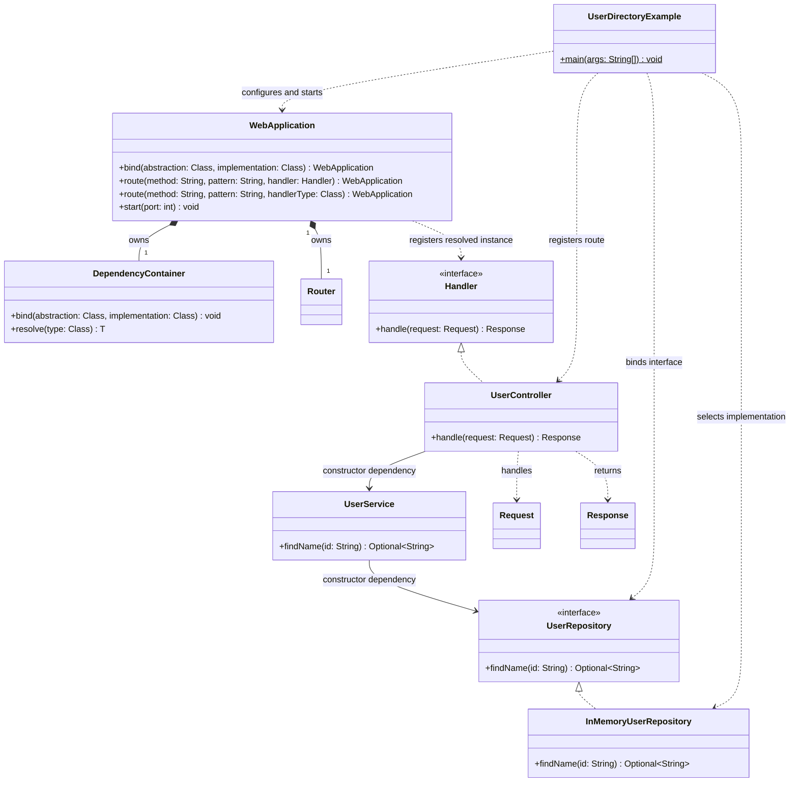

# 類別圖



# 設計說明與實作順序

## 設計說明

- `DependencyContainer`：新公開 API。對具體類別遞迴解析唯一的 public 建構子及其參數；介面或抽象類別必須先以 `bind` 指定實作。每個實作類別在同一容器中只建立一個實例，無論經由介面或具體型別解析都共用。缺少綁定、建構子不唯一或不可用、循環相依及建立失敗時，拋出包含相依路徑的設定錯誤。第一次解析後不再接受新綁定，避免已建立的物件圖與設定不一致。
- `WebApplication`：新增 `bind` 與接受 `Handler` 類別的 `route` 多載。註冊類別路由時，容器立即解析 Controller，再交由現有 `Router` 註冊，因此設定錯誤在啟動伺服器前就會出現；現有的 lambda／`Handler` 實例路由照常可用。綁定應先於類別路由註冊，伺服器執行時不可變更設定。
- `Router`、`Handler`、`Request`、`Response`：既有協作契約；本次不改動這些類別。`UserController` 實作 `Handler`，可直接接入現有路由機制。
- `UserRepository`：範例中的查詢契約，示範介面依賴需明確選擇實作。
- `InMemoryUserRepository`：範例的記憶體資料來源，提供 ID `42` 對應的使用者名稱。
- `UserService`：透過建構子接收 `UserRepository`，提供查詢使用者名稱的服務；不自行建立 Repository。
- `UserController`：透過建構子接收 `UserService`，讀取路徑參數並回傳查詢結果或 404；不自行建立 Service。
- `UserDirectoryExample`：可執行範例，先綁定 `UserRepository` 至 `InMemoryUserRepository`，再以類別註冊 `UserController` 的 `GET /users/{id}` 路由並啟動 HTTP 伺服器。使用者可用 `curl` 查詢 `/users/42`，驗證 Controller → Service → Repository 的建構子注入與 HTTP 回應。

範例預期用法：

```java
new WebApplication()
        .bind(UserRepository.class, InMemoryUserRepository.class)
        .route("GET", "/users/{id}", UserController.class)
        .start(8080);
```

具體類別不需逐一註冊；只有無法從型別唯一推斷的介面／抽象類別需指定實作。本次採用 public 單一建構子約定，不加入註解或 classpath 掃描機制。

## 實作順序

1. 建立 `DependencyContainer`，完成綁定、遞迴建構、單例快取與相依路徑錯誤檢查。
2. 修改 `WebApplication`，持有容器並新增 `bind` 及類別路由多載；沿用既有 `Router`、`Handler`、`Request`、`Response` 契約。
3. 建立範例契約 `UserRepository`，再建立實作 `InMemoryUserRepository`。
4. 建立依賴 `UserRepository` 的 `UserService`，再建立實作 `Handler` 並依賴 `UserService` 的 `UserController`。
5. 建立 `UserDirectoryExample`，加入啟動及 `curl` 使用說明。
6. 驗證完整 HTTP 請求會經過 Controller → Service → Repository，並測試單例共用、缺少綁定、建構子歧義、循環相依、晚綁定拒絕，以及既有 lambda 路由仍可運作。
