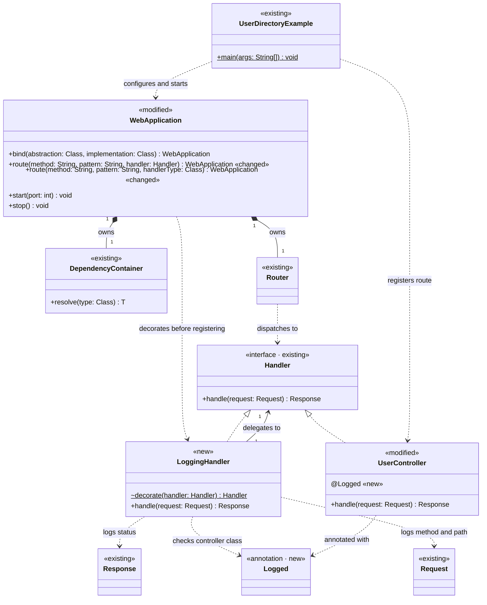

# 類別圖



圖例：

| 標記 | 標在 | 意義 | 樣式類別 |
| ---- | ---- | ---- | -------- |
| `<<new>>` | 類別 | 本次新增的類別 | `added`（綠） |
| `<<modified>>` | 類別 | 既有類別，本次修改其成員或行為 | `changed`（橘） |
| `<<deleted>>` | 類別 | 既有類別，本次刪除 | `removed`（紅色虛線框） |
| `<<existing>>` | 類別 | 既有類別，本次不修改，只呈現協作關係 | `kept`（灰） |
| `«new»` | 成員、關係標籤結尾 | 本次新增的成員或關係 | — |
| `«changed»` | 成員結尾 | 本次修改簽章或行為的成員 | — |
| `«removed»` | 成員、關係標籤結尾 | 本次移除的成員或關係 | — |

# 設計說明與實作順序

## 設計說明

- `Logged`（新增）：框架提供的公開 annotation，`@Retention(RUNTIME)`、`@Target(TYPE)`。Controller 類別掛上 `@Logged` 後，該 Controller 處理的每個 HTTP 請求都會在「請求進入」與「回應輸出」兩個時間點寫 Log。
- `LoggingHandler`（新增，package-private）：實作 `Handler` 的 Decorator，包住原本的 Controller。
  - `decorate(handler)`：handler 的類別有 `@Logged` 時回傳包裝後的 `LoggingHandler`，否則原樣回傳。判斷「是否要記錄」只在這裡發生。
  - `handle(request)`：呼叫 Controller 前寫一筆請求 Log（例：`--> GET /users/42`），拿到 `Response` 後寫一筆回應 Log（例：`<-- 200 GET /users/42 (3 ms)`）。Controller 拋出例外時寫一筆失敗 Log（含例外類別與耗時），再把例外原樣拋出，讓既有的 `JdkHttpServerAdapter` 照舊回 500。
  - Log 沿用專案既有的 `System.Logger`（與 `JdkHttpServerAdapter` 相同，不新增外部依賴），logger 名稱為 Controller 的完整類別名稱，層級為 `INFO`；失敗 Log 為 `WARNING`。
- `WebApplication`（修改）：兩個 `route` 多載在交給 `Router` 註冊前，都先經過 `LoggingHandler.decorate`。
  - 類別路由：先由 `DependencyContainer` 解析 Controller，再包裝。容器中快取的仍是原始 Controller 實例，包裝只影響該條路由。
  - 實例路由：傳入的 `Handler` 實例若類別掛有 `@Logged`，同樣會被包裝；lambda 沒有 annotation，行為不變。
- `UserController`（修改）：類別加上 `@Logged`，作為示範。`handle` 的邏輯不變。
- `DependencyContainer`、`Router`、`Handler`、`Request`、`Response`、`UserDirectoryExample`（既有）：本次不修改。`Router` 只看到 `Handler`，不知道自己分派到的是否為包裝後的物件。
- 範圍界線：Log 只針對掛有 `@Logged` 的 Controller。沒有對應路由的 404、405 與 query 格式錯誤的 400 不會進到任何 Controller，因此不在記錄範圍內。

示範方式（`UserDirectoryExample` 不需改動）：

```sh
mvn -q package
java -cp target/java-web-framework-0.1.0.jar io.github.stevecyj.webframework.example.UserDirectoryExample
curl http://127.0.0.1:8080/users/42
curl http://127.0.0.1:8080/users/missing
```

伺服器終端會出現類似：

```text
INFO: --> GET /users/42
INFO: <-- 200 GET /users/42 (3 ms)
INFO: --> GET /users/missing
INFO: <-- 404 GET /users/missing (0 ms)
```

## 實作順序

1. 建立 `Logged` annotation。
2. 建立 `LoggingHandler`，實作 `decorate` 與 `handle` 的請求、回應、失敗三種 Log；建構子另保留 package-private 的 `System.Logger` 注入點供測試使用。
3. 修改 `WebApplication` 的兩個 `route` 多載，註冊前呼叫 `LoggingHandler.decorate`。
4. 在 `UserController` 加上 `@Logged`，並在 README 補上 Logging 的用法與示範輸出。
5. 新增測試：`@Logged` Controller 會寫出請求與回應 Log、未掛 annotation 的 Controller 與 lambda 不寫 Log、Controller 拋例外時寫失敗 Log 並仍回 500；執行 `mvn test`，最後啟動 `UserDirectoryExample` 以 `curl` 實際展示。
